## Índex

<nav class="toc" aria-label="Índex de la unitat" markdown="1">

1. [SystemV, Upstart i systemd](#1-systemv-upstart-i-systemd)
   1. [Runlevels o targets?](#11-runlevels-o-targets)
   2. [Quin sistema utilitza Ubuntu?](#12-quin-sistema-utilitza-ubuntu)
2. [SystemV](#2-systemv)
   1. [Directoris](#21-directoris)
   2. [Procés d'arrencada](#22-procés-darrencada)
3. [systemd](#3-systemd)
   1. [Directoris](#31-directoris)
   2. [`systemctl`](#32-systemctl)
   3. [Dependències](#33-dependències)
   4. [Modificar el target provisionalment](#34-modificar-el-target-provisionalment)
   5. [Modificar el target definitivament](#35-modificar-el-target-definitivament)
   6. [Afegir serveis a un target](#36-afegir-serveis-a-un-target)
   7. [Crear un target](#37-crear-un-target)
   8. [Crear un servei](#38-crear-un-servei)
   9. [Activitat: target personalitzat d'Eros](#39-activitat-target-personalitzat-deros)

</nav>

## Conceptes bàsics

- **Kernel:** administra el maquinari i els processos.
- **Aplicació:** programa que normalment interactua amb l'usuari.
- **Servei:** programa que s'executa en segon pla.
- **Procés:** instància d'un programa en execució.

## 1. SystemV, Upstart i systemd

SystemV organitza l'arrencada amb scripts i nivells d'execució. Upstart va introduir l'arrencada basada en esdeveniments, mentre que systemd treballa amb unitats, dependències i targets.

### 1.1 Runlevels o targets?

Els runlevels clàssics van del 0 al 6: el 0 apaga, l'1 és de rescat, del 2 al 5 són multiusuari i el 6 reinicia. systemd n'ofereix l'equivalent mitjançant targets.

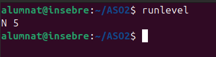

La comanda `runlevel` mostra `N 5`: no hi havia un nivell anterior i el sistema es troba al nivell 5, associat a l'entorn multiusuari gràfic.

### 1.2 Quin sistema utilitza Ubuntu?

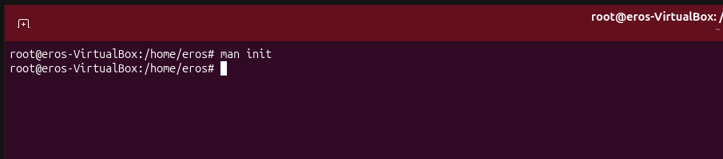

S'executa `man init` per consultar el gestor d'inici, però en aquesta captura la comanda acaba sense mostrar cap pàgina de manual.

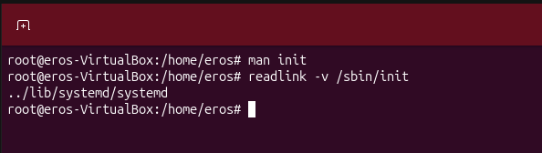

`readlink -v /sbin/init` resol l'enllaç cap a `../lib/systemd/systemd`; per tant, Ubuntu utilitza systemd com a sistema d'inici.

## 2. SystemV

### 2.1 Directoris

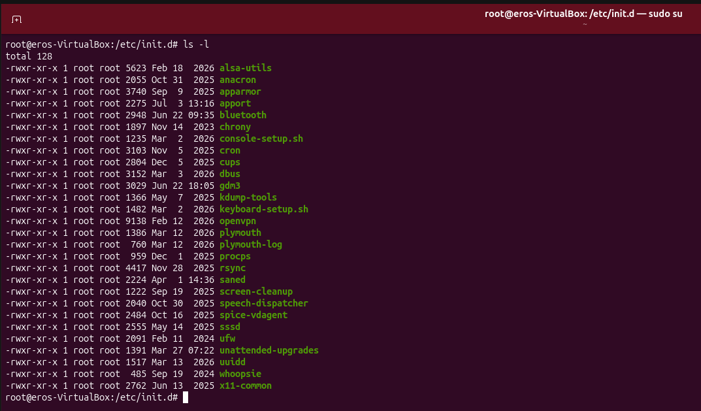

El directori `/etc/init.d` conté els scripts tradicionals dels serveis, com ara `cron`, `ssh`, `cups` o `rsync`.

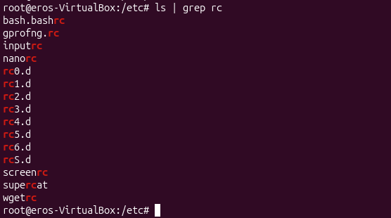

Dins de `/etc` apareixen els directoris `rc0.d` fins a `rc6.d`, un per cada nivell d'execució.

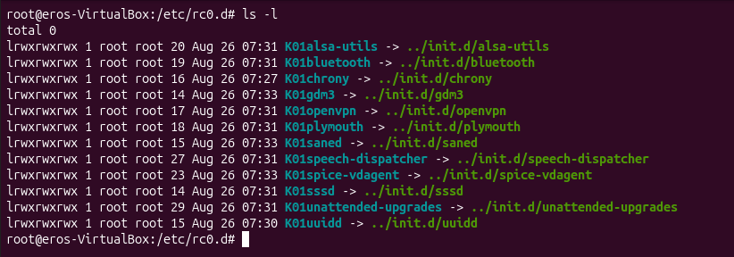

`/etc/rc0.d` conté enllaços amb prefix `K`, utilitzats per aturar serveis quan el sistema entra al nivell d'apagada.

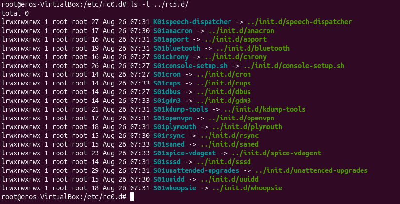

`/etc/rc5.d` mostra principalment enllaços amb prefix `S`, que indiquen els serveis que s'inicien en el nivell 5.

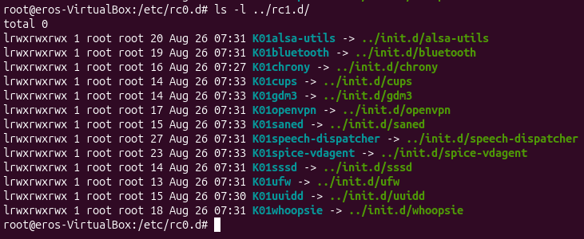

`/etc/rc1.d` conté enllaços `K` perquè el mode d'un sol usuari funciona amb un conjunt mínim de serveis.

### 2.2 Procés d'arrencada

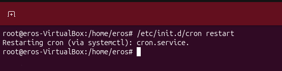

El servei `cron` es reinicia amb `/etc/init.d/cron restart`. El missatge indica que l'script delega l'acció a `systemctl`.

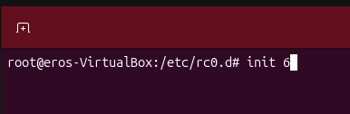

La comanda `init 6` demana canviar al nivell 6 i, per tant, reiniciar el sistema.

## 3. systemd

### 3.1 Directoris

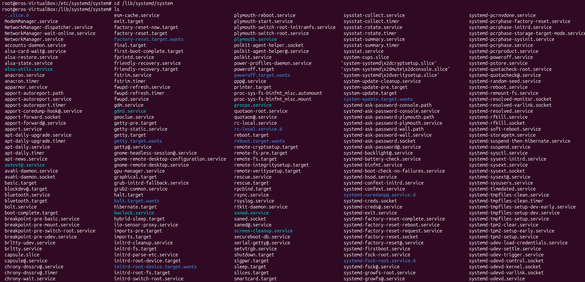

`/lib/systemd/system` conté les unitats proporcionades pels paquets del sistema: serveis, targets, sockets i temporitzadors.

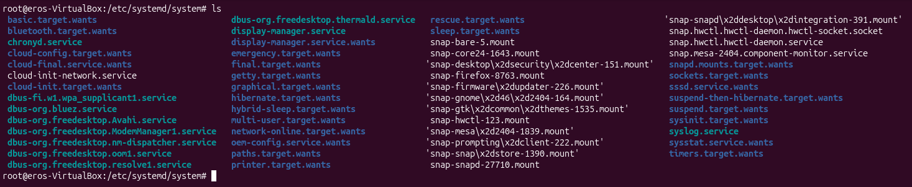

`/etc/systemd/system` conté la configuració local i els enllaços dels serveis habilitats. Aquesta configuració té prioritat sobre la de `/lib`.

### 3.2 `systemctl`

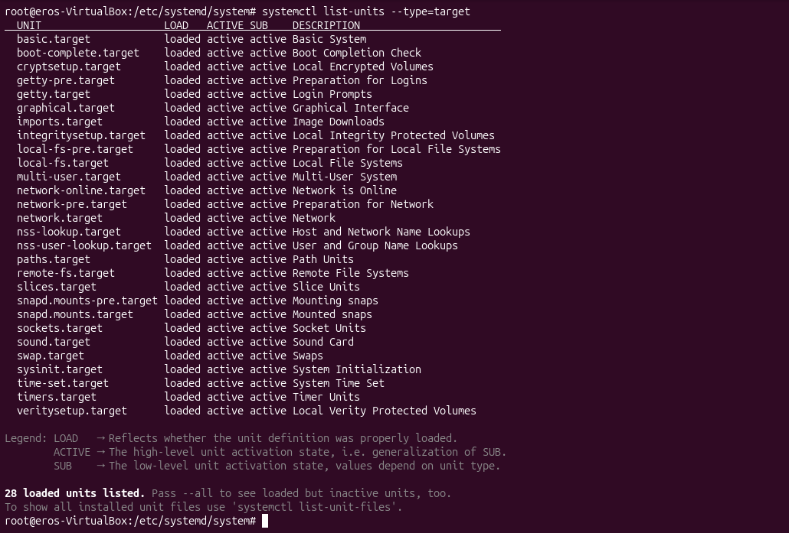

`systemctl list-units --type=target` enumera els targets carregats i actius, com `graphical.target` i `multi-user.target`.

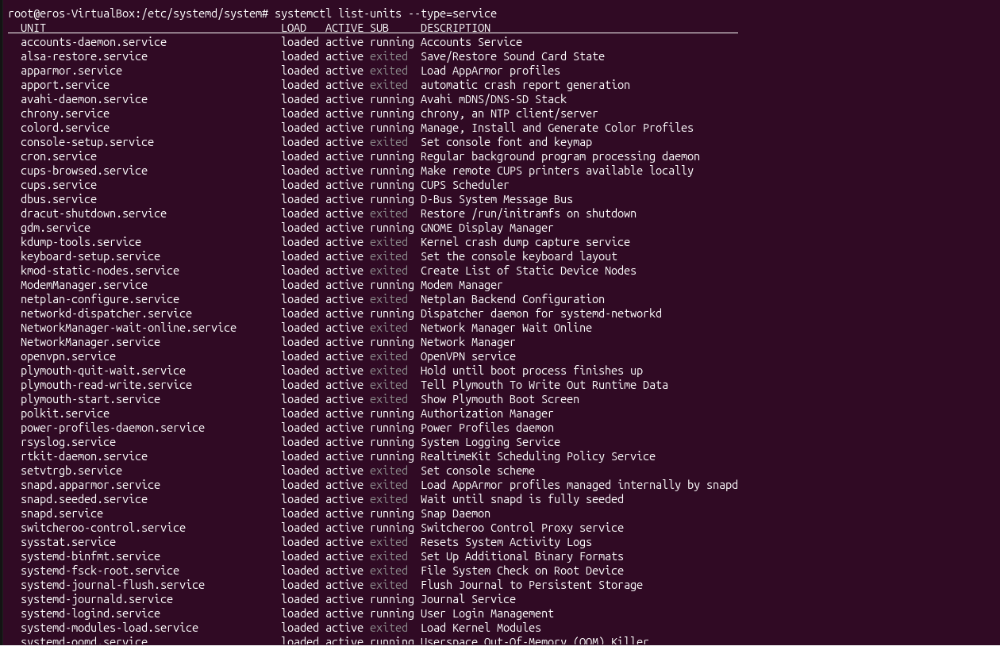

`systemctl list-units --type=service` mostra els serveis carregats i el seu estat, diferenciant els que continuen executant-se dels que ja han finalitzat.

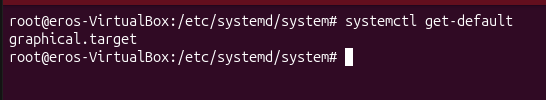

`systemctl get-default` confirma que el target d'arrencada predeterminat és `graphical.target`.

### 3.3 Dependències

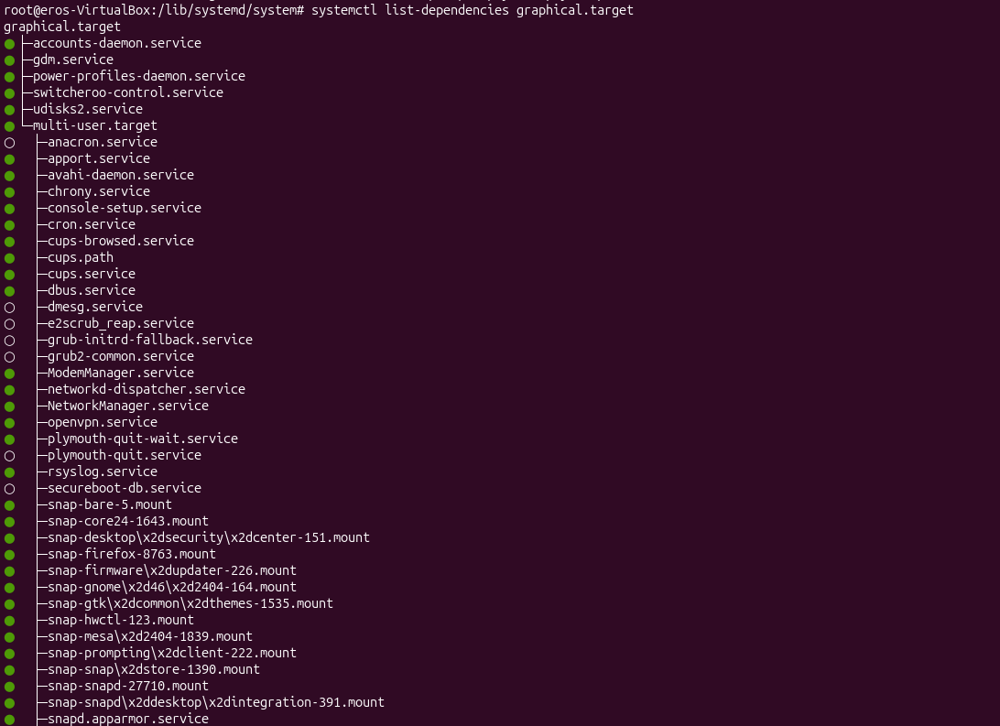

`systemctl list-dependencies graphical.target` mostra l'arbre d'unitats necessàries per arribar a l'entorn gràfic, inclòs `multi-user.target`.

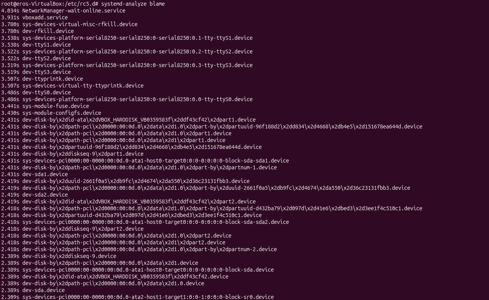

`systemd-analyze blame` ordena les unitats segons el temps que han trigat a iniciar-se; `NetworkManager-wait-online.service` és la més lenta de la llista visible.

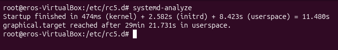

`systemd-analyze` resumeix els temps del kernel, l'initrd i l'espai d'usuari, i indica quan s'ha assolit `graphical.target`.

### 3.4 Modificar el target provisionalment

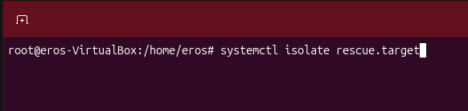

`systemctl isolate rescue.target` canvia temporalment al mode de rescat sense modificar el target de la pròxima arrencada.

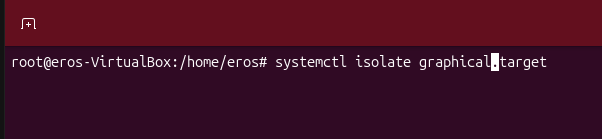

`systemctl isolate graphical.target` torna a activar temporalment l'entorn gràfic.

### 3.5 Modificar el target definitivament

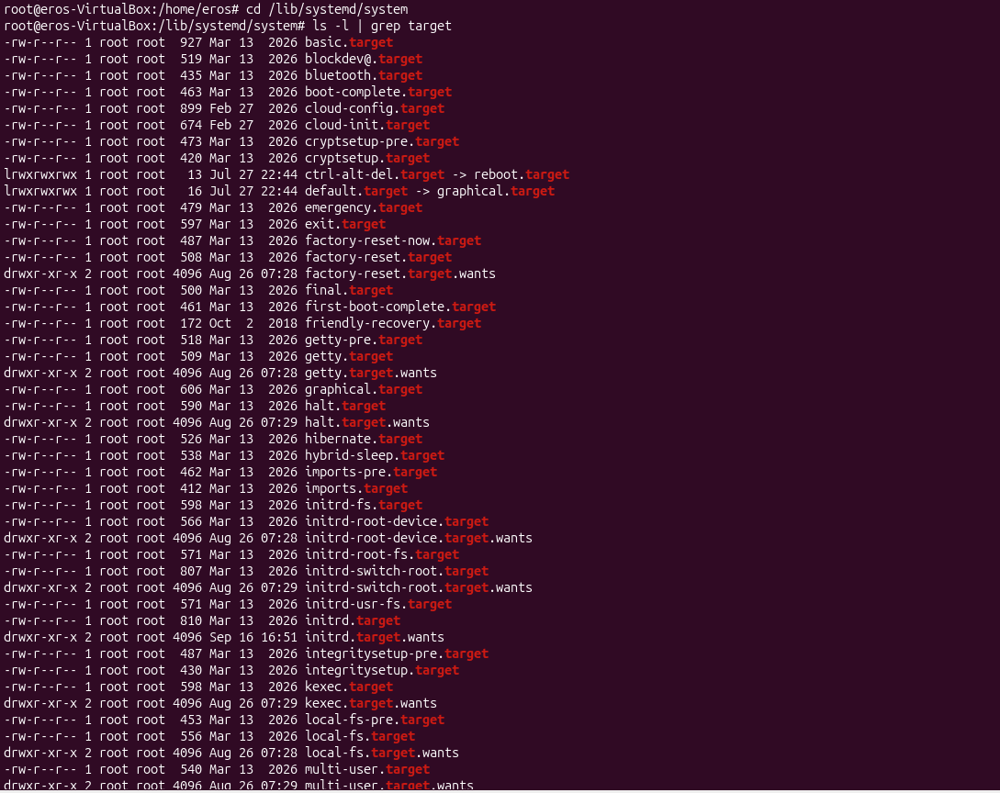

La llista de targets mostra que `default.target` és un enllaç simbòlic cap a `graphical.target`.

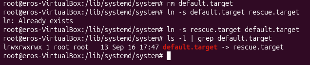

Després d'eliminar l'enllaç anterior, es crea `default.target -> rescue.target`. El primer intent falla perquè l'enllaç encara existia.

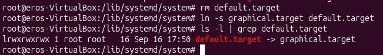

Finalment es torna a crear `default.target -> graphical.target`, restaurant l'arrencada gràfica predeterminada.

### 3.6 Afegir serveis a un target

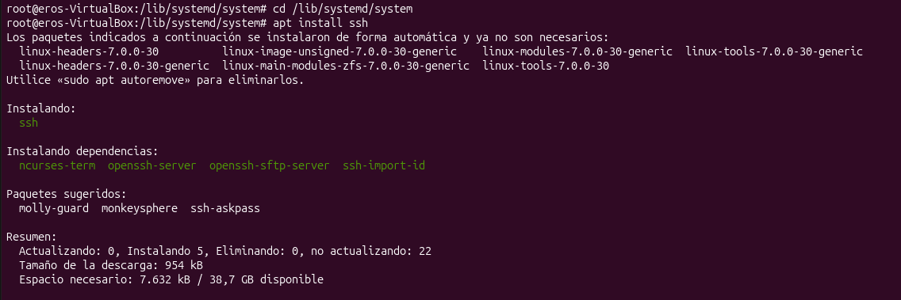

`apt install ssh` inicia la instal·lació del servidor OpenSSH i de les seves dependències.

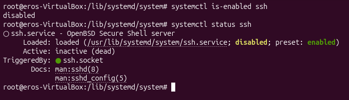

Abans d'habilitar-lo, `ssh.service` apareix com a `disabled` i `inactive (dead)`.

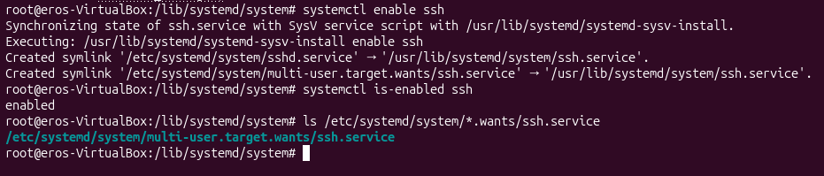

`systemctl enable ssh` crea l'enllaç dins de `multi-user.target.wants`; `is-enabled` confirma que el servei queda habilitat per a l'arrencada.

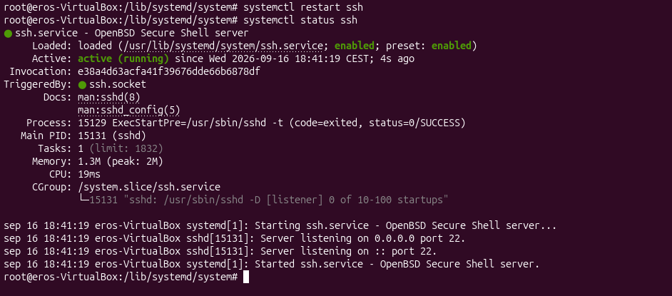

Després de reiniciar-lo, `systemctl status ssh` mostra el servei habilitat i actiu, escoltant al port 22.

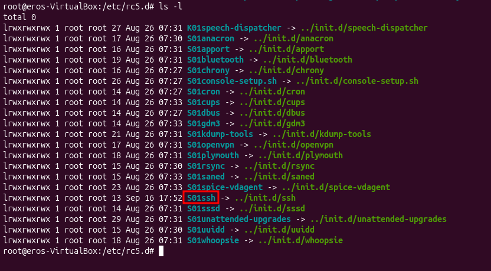

També apareix l'enllaç `S01ssh` a `/etc/rc5.d`, que manté la compatibilitat amb l'esquema de SystemV.

### 3.7 Crear un target

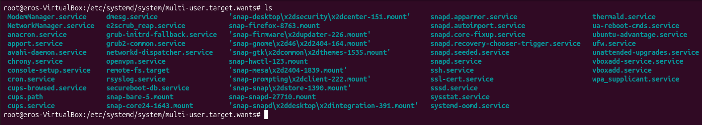

El directori `multi-user.target.wants` mostra com s'associen les unitats a un target mitjançant enllaços, inclòs `ssh.service`.

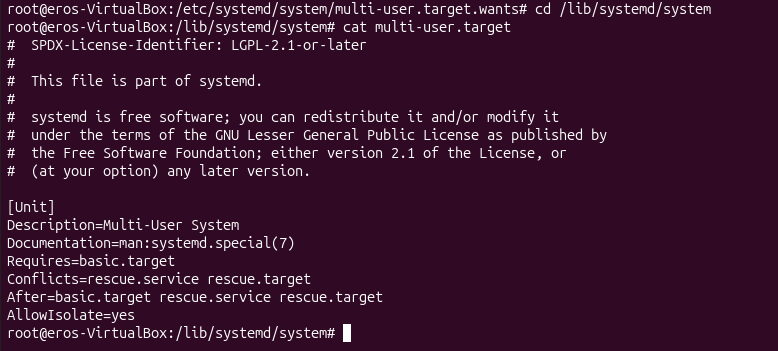

El fitxer `multi-user.target` serveix de model: declara dependències amb `Requires` i `After`, entra en conflicte amb `rescue.target` i permet l'ús d'`isolate`.

### 3.8 Crear un servei

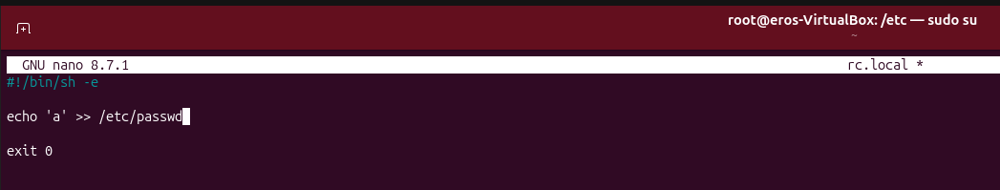

Es crea `/etc/rc.local` amb un script que afegeix una línia `a` a `/etc/passwd`. És una prova amb permisos de root que no s'hauria d'utilitzar en un sistema real.

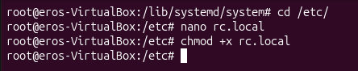

`chmod +x rc.local` converteix el fitxer en executable perquè systemd el pugui iniciar.

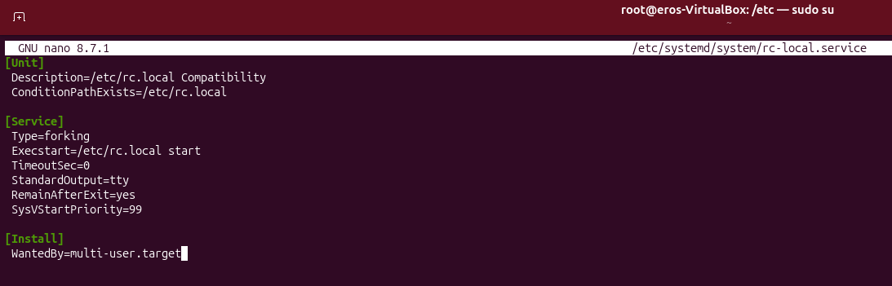

La unitat comprova que `/etc/rc.local` existeixi, l'executa amb `ExecStart` i queda associada a `multi-user.target`.

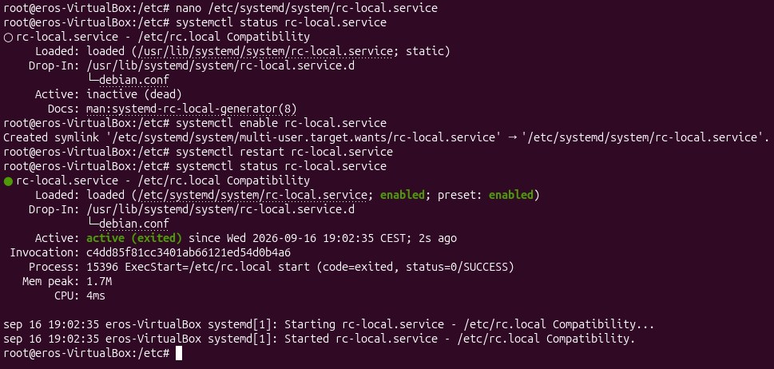

El servei s'habilita, es reinicia i queda en estat `active (exited)`, amb codi de sortida correcte.

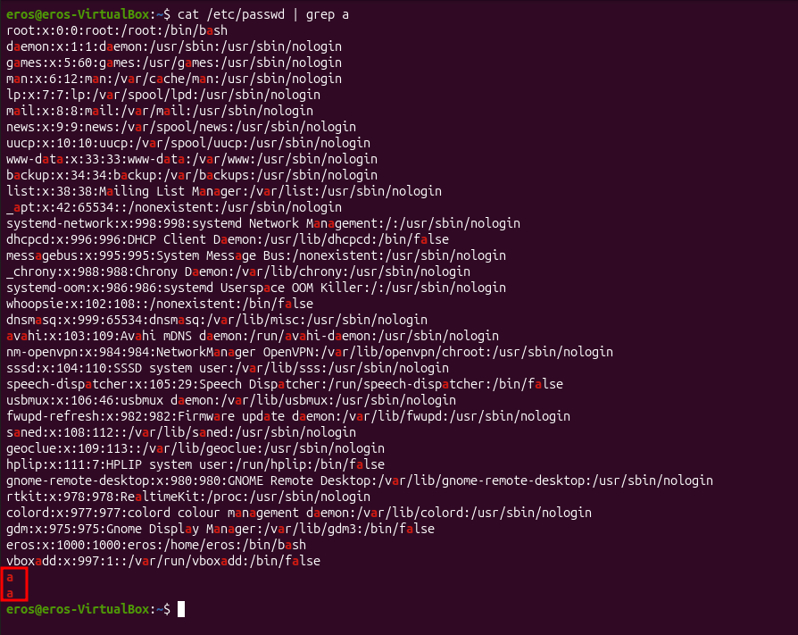

La consulta d'`/etc/passwd` mostra dues línies finals amb `a`, fet que confirma dues execucions de l'script. La resta de coincidències provenen d'altres línies que també contenen aquesta lletra.

### 3.9 Activitat: target personalitzat d'Eros

L'objectiu és crear `eros.target`, fer-lo predeterminat i executar-hi un servei propi amb permisos de root abans d'arribar a l'entorn gràfic.

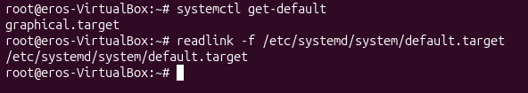

`systemctl get-default` confirma que el sistema arrenca inicialment amb `graphical.target`.

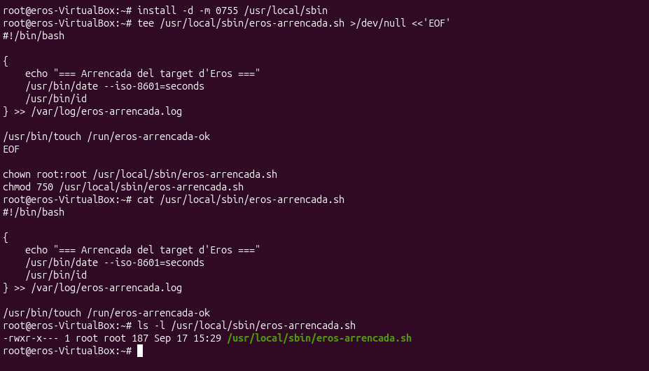

Es crea `eros-arrencada.sh`, que registra la data i l'usuari d'execució, i genera el fitxer de control `/run/eros-arrencada-ok`. Només root el pot executar.

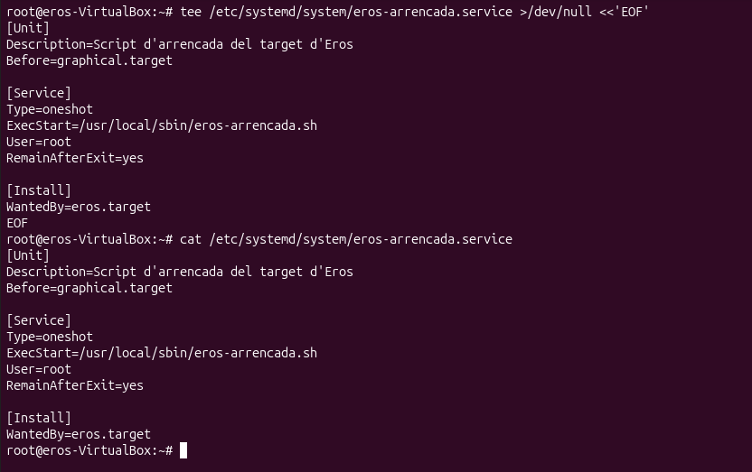

El servei és de tipus `oneshot`, executa l'script com a root i queda associat a `eros.target`.

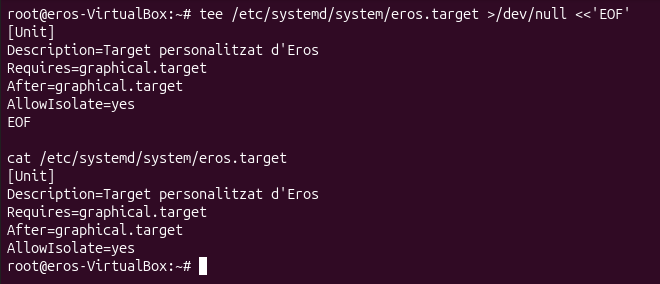

`eros.target` requereix l'entorn gràfic i permet utilitzar-lo amb `systemctl isolate`.

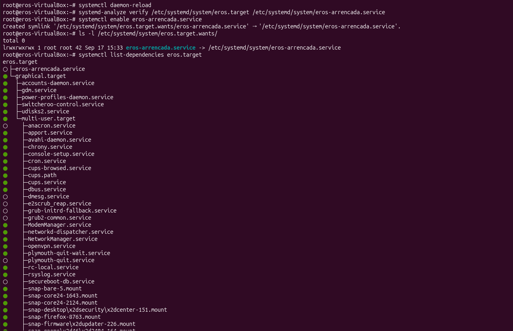

Després de recarregar systemd, els fitxers es validen sense errors. En habilitar el servei es crea l'enllaç dins d'`eros.target.wants` i apareix a l'arbre de dependències.

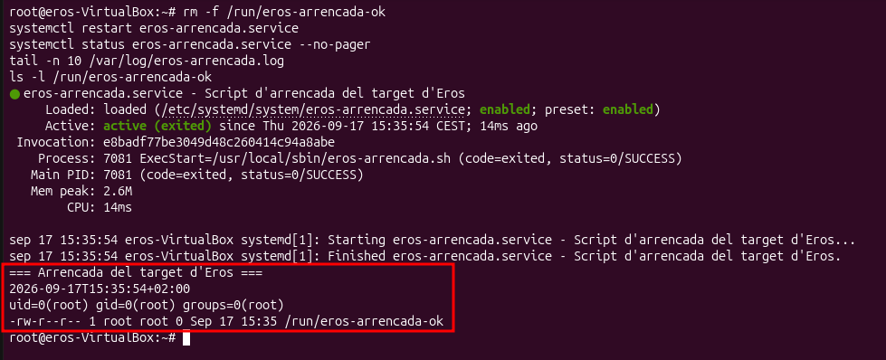

El servei finalitza correctament com a `active (exited)`. El registre mostra `uid=0(root)` i el fitxer de control confirma l'execució.

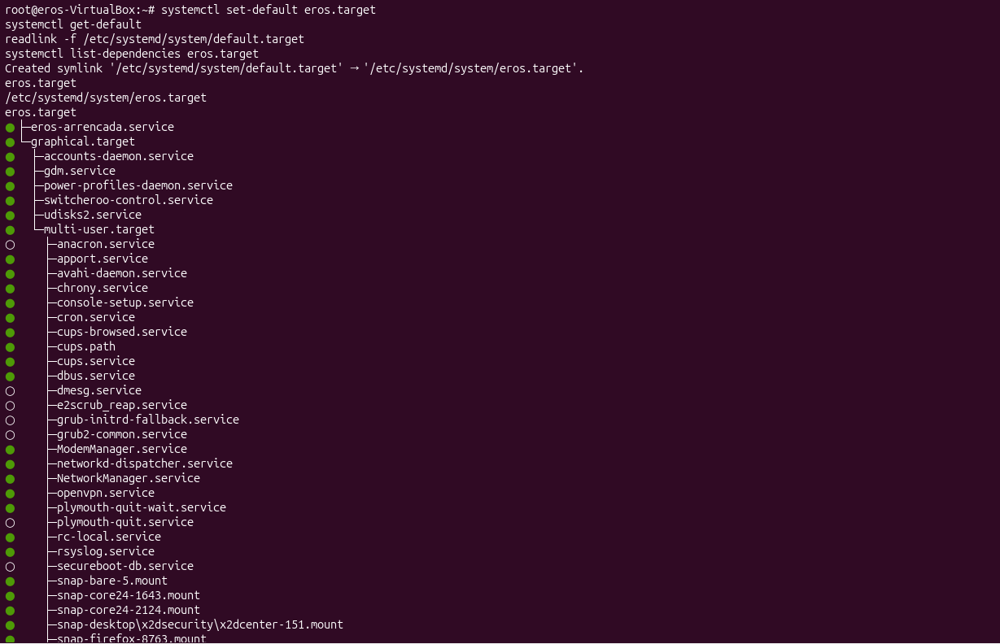

`systemctl set-default` canvia l'arrencada a `eros.target`; tant `get-default` com l'enllaç `default.target` ho confirmen.

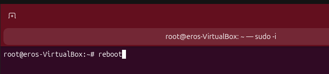

Es reinicia la màquina virtual per comprovar que el target i el servei funcionen durant una arrencada real.

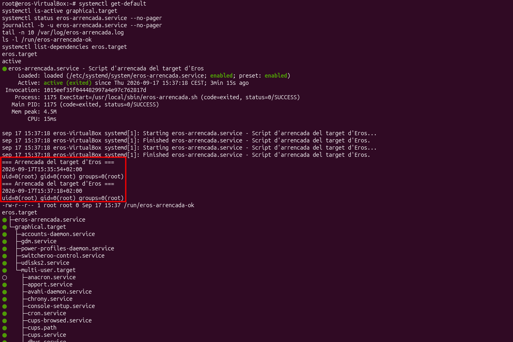

Després del reinici, `eros.target` és el predeterminat, l'entorn gràfic continua actiu i el servei s'ha executat correctament com a root. El registre conté una entrada nova i el fitxer de control existeix.
